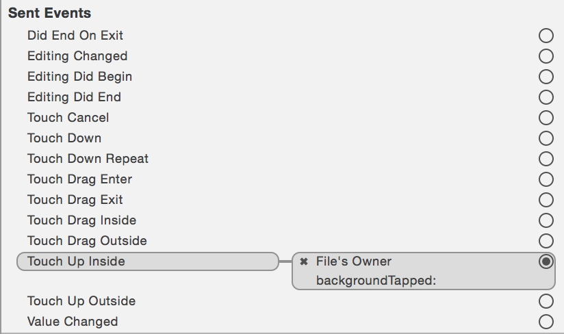

很多时候，我们需要关闭弹出的虚拟键盘，这里我们就讨论一下关闭键盘的多种方法。

<!--more-->

## 原理解析

[苹果官方文档](https://developer.apple.com/library/ios/documentation/UIKit/Reference/UITextField_Class/index.html)中是这么描述的：

> 在用户进行了特定的操作的时候，可能需要将键盘隐藏。如果需要在点击键盘上的 `return` 按钮时隐藏，需要设置文本输入框的 `delegate`。为了隐藏按钮，需要向当前的第一响应者(first responder)发送 `resignFirstResponder` 消息。这样可以让该文本输入框结束当前的输入会话，并隐藏键盘。

那么问题的关键就是向第一响应者发送 `resignFirstResponder` 消息。

```objectivec
[yourTextFieldName resignFirstResponder];
```

## 问题

但是问题来了，如果界面上有多个文本输入框怎么办，并不知道哪个输入框才是第一响应者。

### 方法一

最直观的方法就是给每一个文本输入框都发送 `resignFirstResponder` 消息。

```objectivec
  [self.yourTextField1 resignFirstResponder];
  [self.yourTextField2 resignFirstResponder];
  ...
  [self.yourTextFieldn resignFirstResponder];
```

### 方法二

当然，还有一种稍微聪明一些的方式，传入整个 `view`：

```objectivec
UIView *resignFirstResponder(UIView *theView)
{
  if([theView isFirstResponder]) {
    [theView resignFirstResponder];
    return theView;
  }
  for(UIView *subview in theView.subviews) {
    UIView *result = resignFirstResponder(subview);
    if(result) return result;
  }
  return nil;
}
```

遍历传入的 `view` 的所有子视图，并发送 `resignFirstResponder` 消息。

### 方法三

有没有相对优雅一点的方法呢。当然，下面的方法和方法二中提供的方法原理一致，不过有造好的轮子干嘛不用呢。

```objectivec
[self.view endEditing:YES];
```

是不是简洁明了多了！

## 键盘 `return` 键隐藏键盘

原理与上述方法一致，只是要求响应点击 `return` 键的事件。

1. 将 TextField 的 delegate 设置为实现 `textFieldShouldReturn:(UITextField *)textField` 方法的类（一般为相应的 ViewController）
2. 遵循 `UITextFieldDelegate` 协议，并实现 `textFieldShouldReturn`方法：

```objectivec
- (BOOL)textFieldShouldReturn:(UITextField *)textField {
  [textField resignFirstResponder];
  return YES;
}
```

## 点击空白处，隐藏键盘

有时我们需要在点击界面的空白处隐藏键盘，这是一个非常便利的操作。
这里我们的思路是，响应点击空白处的事件，并调用相应的 `endEditing` 方法。为了响应空白处的点击事件，需要将 `xib` 文件（或 `stroyboard`）文件中响应的 View Class 改为 `UIControl`，之后设定相关的 Target-Action

并实现相关的方法：

```objectivec
- (IBAction)backgroundTapped:(id)sender {
  [self.view endEditing:YES];
}
```
