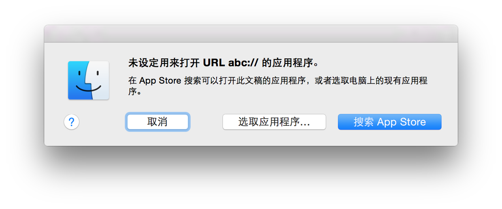

在苹果的系统中，我们经常需要在一个应用中，打开另外的一个应用以完成一些操作。举个例子，在网页中访问 App Store 时，可以通过链接打开本地的 iTunes 应用，在手机应用中，点击某个电话号码，可以跳转到相应的拨号界面，这些，其实都是通过 URL Scheme 机制来完成的。

<!--more-->

举个例子，打开网页版的 App Store，找到在社交应用中找到 QQ，选择`在iTunes中查看`，会有图下提示：

仔细观察会发现，链接以 `xxx://` 开头，如果我们手动输入这个链接会如何呢，打开**Safari**（注意选 Safari 作为实验对象），手动输入如下链接[abc://](abc://)（或者点击本页面的该链接），会发现如下结果

我们不难发现规律，如果上面的`abc`是一个应用的话，应该可以响应该请求，如果链接后面有参数的话，应该也可以获得。

其实 iOS 平台也是如此，大家可以试试。

那么作为开发者，我们该如何使用这个特性呢？

举例来说，如果我们需要使用 `OAuth` 获得授权，可以向认证服务器发送请求，授权成功之后，可以使用 URL Scheme 技术，标明跳转到我们的应用，并将获得用户授权的 Token 传递给应用程序。

实例如下：

1. 新建一个 iOS 应用
2. 稍微改变一下 Storyborad 的样式，来标识这个应用
3. 让应用响应某个 URL Scheme

第三步才是最关键的，在 `Info.plist` 文件中加入如下参数


或者可以通过修改 `Info.plist` 源码的方式，在其中添加如下代码

```xml
<key>CFBundleURLTypes</key>
<array>
  <dict>
    <key>CFBundleURLSchemes</key>
    <array>
      <string>FTAPP</string>
    </array>
    <key>CFBundleURLName</key>
    <string>com.futantan.www</string>
  </dict>
</array>
```

其中的 URL identifier 也就是源码中的 CFBundleURLName 可以随意改动，建议使用自己的反序域名，其中的 URL Schemes 是一个数组，这里我们添加了一个条目，为 FTAPP，这个内容也就是标识我们的应用的，当浏览器访问 [FTAPP://](FTAPP://) 的时候，应该会跳转到我们的应用程序。


在浏览器输入之后，果然会弹出一个对话框，表明要跳转到我们的应用。

那么我们如何通过该方法来拿到一些参数呢？在 `AppDelegate` 中，使用如下函数：

> func application(app: UIApplication, openURL url: NSURL, options: [String : AnyObject]) -> Bool

使用该函数，参数中的 url 包含了链接中的所有信息。

That's it!
