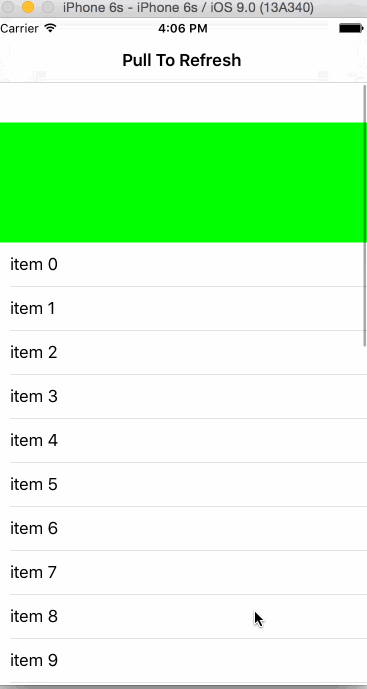

仿照「把大象放进冰箱」的思路，Pull To Refresh 的过程可以分解成如下步骤：

1. 在顶部添加下拉出来的视图
2. 当下拉到一定位置的时候固定视图，写个动画得瑟一下
3. 动画过程中进行访问服务器等操作
4. 等活儿干完了通知下拉视图躲起来

<!--more-->

## 准备工作

其实需要准备的并不多，首先新建一个工程，使用 TableView，造一些 fake data，让视图更美观一些。当然，如果你不想做这些无用功，可以在 [这里](https://github.com/futantan/FTPullToRefreshDemo/archive/v0.1.zip) 下载我们的 Start Project。

目前，视图应该长这样：


代码中只是简单设置了下有多少行数据，每行显示一些简单的文字。

## 添加下拉视图

我们需要在 TableView 的顶端添加一个视图，在下拉的时候，将它一同「拽」下来。我们新建一个 UIView 的子类 `RefreshView`

```swift
class RefreshView: UIView {
  var progress: CGFloat = 0.0
  var isRefreshing: Bool = false

  override init(frame: CGRect) {
    super.init(frame: frame)
    self.backgroundColor = UIColor.greenColor()
  }

  required init?(coder aDecoder: NSCoder) {
      fatalError("init(coder:) has not been implemented")
  }
}
```

内容也非常简单，设置了 `frame`。同时，为了记录下拉的程度，添加了一个`progress`变量来记录它。用`isRefreshing`来表示是否正在刷新，并设置了一个背景颜色来更好的区分。我们在 `ViewController` 中来添加这个视图到我们的 tableView 上。

在 `ViewController` 中添加一个实例变量来表示下拉视图：

```swift
var refreshView: RefreshView!
```

在 `viewDidLoad()` 方法中，添加如下代码：

```swift
let kRefreshViewHeight: CGFloat = 120.0
let refreshFrame = CGRect(x: 0.0, y: -kRefreshViewHeight, width: CGRectGetWidth(view.frame), height: kRefreshViewHeight)
refreshView = RefreshView(frame: refreshFrame)
view.addSubview(refreshView)
```

运行之后，会发现下拉的时候，上面会出现绿色的区域，这就是我们添加的 RefreshView 视图啦。

<!--（如果不理解 refreshFrame 的 y 取值，可以看[这篇博客]()）-->

## 下拉时的事件响应

在下拉的过程中，有时我们会需要根据下拉的长度来做相应的动画，比如，下拉过程中，开始画一个圆，下拉到一定的程度之后，整个圆就绘制完成了。为了达到这个目的，需要知道表格视图向下滑动了多少距离。

`UITableView`是`UIScrollView`的子类，而`UITableViewController`又实现了`UIScrollViewDelegate`协议。在下拉的过程中， `UIScrollViewDelegate` 的方法会得到调用，我们可以在这里动态获得下拉的距离。

在 `ViewController` 类的外面，添加如下代码

```swift
// MARK: - UIScrollViewDelegate
extension ViewController {
  override func scrollViewDidScroll(scrollView: UIScrollView) {
    // 这儿获得下拉距离
  }
}
```

> 类的扩展，extension 可以帮助我们分割代码块区域，使得代码在源文件中看起来更加有条理，可以参照示例代码中的 UITableViewDataSource 和 UITableViewDelegate 的实现。

这里我们可以进行计算，得到下拉的距离，但是作为一个对代码整洁有追求的程序员，我们来思考一下职责单一的问题。

`RefreshView`作为下拉的视图，不应该与视图控制器过度耦合。我们可以把`tableView`的滚动事件传递给`RefreshView`，让它自己来计算，判断，进行各种逻辑的处理。

从上面的代码来看，`scrollViewDidScroll(scrollView: UIScrollView)`函数在下拉的时候，不断调用，其实是把每次更新后的`scrollView`传递过来，然后通过它的属性变化来做处理，这里我们可以将`scrollView`参数传递给我们的`RefreshView`视图。

思路明确，在 `ViewController` 的 `scrollViewDidScroll` 方法调用的时候，我们调用 `RefreshView` 的方法，将 `scrollView` 参数传进去。我们干脆使用和 `UIScrollViewDelegate` 协议中一样的方法名，我们让 `RefreshView` 实现 `UIScrollViewDelegate` 协议，这样也方便方法名补全。

在 RefreshView 类外面，添加如下代码：

```swift
// MARK: - UIScrollViewDelegate
extension RefreshView: UIScrollViewDelegate {
  func scrollViewDidScroll(scrollView: UIScrollView) {
    print(scrollView.contentOffset)
  }
}
```

于是，我们可以在 `ViewController` 的 `scrollViewDidScroll` 方法中，调用该方法。在该方法中添加如下语句

```swift
self.refreshView.scrollViewDidScroll(scrollView)
```

运行，下拉视图，可以发现，不断有 print 语句输出。成功！

根据这个思路，我们来计算下拉程度，在 `RefreshView` 的 `scrollViewDidScroll` 方法中，添加如下代码

```swift
// 计算向下滑动了多少距离
let offsetY = max(-(scrollView.contentOffset.y + scrollView.contentInset.top), 0.0)
self.progress = min(offsetY / frame.size.height, 1.0)

if !isRefreshing {
	animateWithProgress(progress)
}
```

计算过程中，如果开始时候向上拉动，不计入拉动距离，如果已经超过了 `RefreshView` 视图的高度，`progress` 仍然为 1。之后判断是否正在刷新，如果不是，进行下拉时候的动画。这里我们添加一些动画调用接口，方便之后的使用。为 `RefreshView` 类添加如下方法：

```swift
// 在下拉过程中的动画
func animateWithProgress(progress: CGFloat) {
  print("animate... with progress")
}

// 下拉到一定程度之后，确认刷新的动画
func animateWhileRefreshing() {
  isRefreshing = true
  print("animate... while refreshing")
}

// 当刷新工作完成之后调用
func endRefreshing() {
  isRefreshing = false
}
```

动画接口已经完成，我们之后可以很方便在这些方法中实现我们的动画效果。

## 设置 delegate

在下拉到一定程度，松开手指的时候，会触发刷新，这时候让去做一些像访问服务器等比较费时的操作，同时，`RefreshView` 需要固定在 `tableView` 视图的上端，在完成网络访问等操作之后，再取消固定，恢复当初的模样。

为了能够让触发刷新时，执行一些 `ViewController` 中定义的工作，我们需要使用 `Delegate` 模式。在 `RefreshView` 类上面，定义个一个 protocol：

```swift
protocol RefreshViewDelegate {
  func refreshViewDidRefresh(refreshView: RefreshView)
}
```

这里我们定义了一个 protocol，简单来说就是一个占位符，我们将在适当的时候，调用协议中的方法，而对于 `RefreshView` 来说，它对方法的具体内容一无所知，方法的将在遵循这个协议的具体类中实现。为了能够调用该方法，我们需要为 RefreshView 添加一个成员变量

```swift
var delegate: RefreshViewDelegate?
```

现在我们来思考，什么时候调用协议的方法呢？当用户下拉到一定程度（这里是超过 `RefreshView`）的高度，松开手指的时候，我们需要调用该方法来实现一些费时的操作。为了响应下拉之后松开的事件，我们需要实现 `UIScrollViewDelegate` 中的 `scrollViewWillEndDragging:withVelocity:targetContentOffset:` 方法，按照同样的思路，我们将这个方法的参数传递给 `RefreshView`，让它自行处理

在 `RefreshView` 的 `scrollViewDidScroll` 方法下面，添加如下方法：

```swift
func scrollViewWillEndDragging(scrollView: UIScrollView, withVelocity velocity: CGPoint, targetContentOffset: UnsafeMutablePointer<CGPoint>) {
  if !isRefreshing && self.progress == 1.0 {
    delegate?.refreshViewDidRefresh(self)
    animateWhileRefreshing()
  }
}
```

在方法中，如果没有进行刷新，并且下拉的程度足够的话，就进行刷新，同时调用 `RefreshViewDelegate` 协议中的方法，并开始刷新的动画。下面需要在 `ViewController` 中，将松开手指的事件传递过来，在 `ViewController` 的 `scrollViewDidScroll` 方法下面，添加如下代码：

```swift
override func scrollViewWillEndDragging(scrollView: UIScrollView, withVelocity velocity: CGPoint, targetContentOffset: UnsafeMutablePointer<CGPoint>) {
  refreshView.scrollViewWillEndDragging(scrollView, withVelocity: velocity, targetContentOffset: targetContentOffset)
}
```

这里与之前的做法相同，只是将所有参数传递给了 `RefreshView`。

为了在触发刷新的时候进行相应的事物处理操作，需要让 `ViewController` 遵循 `RefreshViewDelegate` 协议，并实现相应的方法，这里我们只是简单的输出了一条语句。

```swift
// MARK: - RefreshViewDelegate
extension ViewController: RefreshViewDelegate {
  func refreshViewDidRefresh(refreshView: RefreshView) {
    print("搬砖")
  }
}
```

同时，在 `viewDidLoad` 实例化 `RefreshView` 之后，将它的 `delegate` 设置为 `ViewController`

```swift
refreshView.delegate = self
```

## 固定 RefreshView 视图

编译运行，哦吼，出现问题了，这里的视图并没有在执行刷新动画（目前仅是输出一条语句）的时候固定住。我们希望在刷新被触发的时候，顶部的视图能够固定住，然后，当 RefreshViewDelegate 中的方法执行完成的时候，再隐藏顶部视图。

思路明确，要能够固定住视图，并且能够取消固定。为了固定该视图，我们需要增加 `ScrollView` 的 `contentInset.top`，取消的话将该值复原就可以了。这里为了能够改变 `ScrollView` 的这个属性，我们需要拿到 `ScrollView` 的引用，修改 `RefreshView` 的 `init` 方法，改为如下：

```swift
unowned var scrollView: UIScrollView

init(frame: CGRect, scrollView: UIScrollView) {
  self.scrollView = scrollView
  super.init(frame: frame)
  self.backgroundColor = UIColor.greenColor()
}
```

同时修改 `ViewController` 中的 `refreshView` 实例化代码，改为：

```swift
refreshView = RefreshView(frame: refreshFrame, scrollView: tableView)
```

下面为 `RefreshView` 添加是否固定视图的方法

```swift
func shouldRefreshViewBeLocked(shouldLock: Bool) {
  var contentInset = self.scrollView.contentInset
  contentInset.top = shouldLock ?
    (contentInset.top + self.frame.size.height) : (contentInset.top - self.frame.size.height)
  self.scrollView.contentInset = contentInset
}
```

在触发刷新的时候需要固定视图，在 `scrollViewWillEndDragging` 方法中的 `if` 语句中，添加如下代码：

```swift
shouldRefreshViewBeLocked(true)
```

这时候编译运行，下拉到一定程度之后，会固定住视图。


下面要做的就是在用户完成访问网络等操作之后，显式调用方法来取消固定。修改 `endRefreshing` 方法如下：

```swift
func endRefreshing() {
  isRefreshing = false
  shouldRefreshViewBeLocked(false)
}
```

修改 `ViewController` 的 `refreshViewDidRefresh` 方法：

```swift
func refreshViewDidRefresh(refreshView: RefreshView) {
  print("搬砖3秒")
  let time = dispatch_time(DISPATCH_TIME_NOW, Int64(3*NSEC_PER_SEC))
  dispatch_after(time, dispatch_get_main_queue()) { () -> Void in
    refreshView.endRefreshing()
  }
}
```

这里模拟费时的操作，在 3 秒之后，取消 `RefreshView` 的视图固定。

编译运行，默数 1，2，3，果然视图取消固定了！但是这里取消固定的时候有些突兀，我们加上一个简单的动画，让它看起来更自然一些，修改 `RefreshView` 的 `endRefreshing` 方法：

```swift
func endRefreshing() {
  isRefreshing = false
  UIView.animateWithDuration(0.3, delay: 0.0, options: [.CurveEaseOut], animations: {
    self.shouldRefreshViewBeLocked(false)
    }, completion: nil)
}
```

到这里，从零开始做一个下拉刷新控件已经完成了，从视觉上并没有多么漂亮，但是一些动画的接口我们已经留好，只需要添加一些动画的代码就可以了。如果你需要完成后的代码，可以从[这里下载](https://github.com/futantan/FTPullToRefreshDemo/archive/v0.2.zip)

参考资料

[raywenderlich](http://www.raywenderlich.com/video-tutorials)
