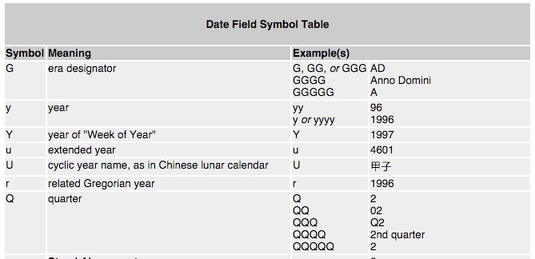

> 更新： 收藏这个网址 [nsdateformatter](http://nsdateformatter.com/)，这篇博客不用看了！

在和服务器交互数据的时候，使用到 NSDate，无论是将服务器返回的 String 类型的日期字符串转为 NSDate，还是 NSDate 到 String 类型的逆向处理，都是经常要做的事情，这里主要是和大家分享一个特别棒的网站。

<!--more-->

## String To Date

来看一个具体的场景，比如，服务器端给我们返回的日期字段为 `2016-03-05T11:35:05Z`，String 类型，我们使用下面的做法来处理：

```swift
let stringToDateFormatter = NSDateFormatter()
stringToDateFormatter.dateFormat = "yyyy-MM-dd'T'kk:mm:ssZ"
stringToDateFormatter.timeZone = NSTimeZone.localTimeZone()
let date = stringToDateFormatter.dateFromString(dateString)
```

其实很简单，关键在于 "yyyy-MM-dd'T'kk:mm:ssZ"，如何快速正确的写出这个 format 字符串呢，给大家推荐一个网站 [Formatting Dates and Times](http://userguide.icu-project.org/formatparse/datetime)



amazing！再也不用担心不会写日期格式化字符串了！

## Date To String

现在我们来将 NSDate 转为 想要的 String 类型，比如上面的时间，我想要的输出是 "Mar 5, 2016"
可以使用如下代码：

```swift
let dateToStringFormatter = NSDateFormatter()
dateToStringFormatter.dateFormat = "MMM d, yyyy" //Mar 5, 2016
print(dateToStringFormatter.stringFromDate(date!))
```

希望看完这篇博文，在以后遇到类似情况的时候，能够节省下您 5 分钟的搜索时间。
enjoy~
