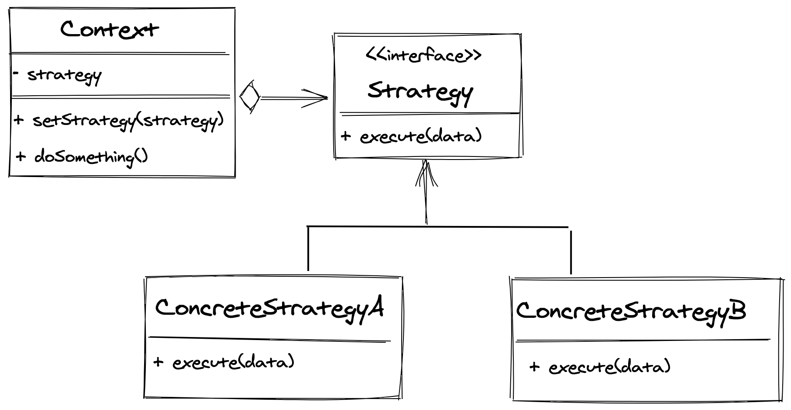

## 要解决的问题

想象一下，对于某个任务，我们需要支持多种解决方案。而这多种支持就是变化点，为了封装变换点，我们可以采用策略模式。

## 定义

> 定义了一系列的算法，把它们分别封装起来，并且使它们可以相互替换。

此模式让算法的变化独立于使用算法的客户。

## 面向对象的方式

### UML



如上图所示，

- `Strategy` 接口定义了算法的行为
- 一系列的算法 `ConcreteStrategyA` 和 `ConcreteStrategyB` 分别实现了该接口
- 策略被包含在一个 `Context` 中，拥有私有的 `strategy` 实例，从而执行具体的算法行为
- 通常 `Context` 中还会包含一个 `setStrategy` 方法，从而动态改变策略

### 代码

首先我们定义一个接口 `IStrategy`

```typescript
interface IStrategy {
  calculate(a: number, b: number): number
}
```

它要求实现一个名为 `calculate` 的方法，该方法接受两个 `number` 类型的参数，最终返回一个 `number` 类型的值。

```typescript
class AddStrategy implements IStrategy {
  calculate(a: number, b: number): number {
    return a + b
  }
}

class SubtractStrategy implements IStrategy {
  calculate(a: number, b: number): number {
    return a - b
  }
}
```

这里我们定义了两个具体的策略类 `AddStrategy` 和 `SubtractStrategy`，它们都实现了 `IStrategy` 接口。

最终我们来定义 `Context` 类：

```typescript
class Context {
  private strategy: IStrategy

  constructor(strategy: IStrategy) {
    this.strategy = strategy
  }

  public setStrategy(strategy: IStrategy) {
    this.strategy = strategy
  }

  public calculate(a: number, b: number) {
    return this.strategy.calculate(a, b)
  }
}
```

类中包含一个私有的成员属性 `strategy`，可以通过构造函数赋值，也可以通过 `setStrategy` 来动态改变。最后 `calculate` 方法将会代理到具体的策略类上，并执行具体的算法。

```typescript
const context = new Context(new AddStrategy())
console.log(context.calculate(1, 2)) // 3
context.setStrategy(new SubtractStrategy())
console.log(context.calculate(1, 2)) // -1

context.setStrategy(new SubtractStrategy())
console.log(context.calculate(1, 2)) // -1
```

[完整代码](https://github.com/futantan/rethinking-in-design-pattern/blob/master/strategy/strategy.oo.ts)

## 带上函数式的思考帽

我们再回过头来思考策略的定义方式：

```typescript
interface IStrategy {
  calculate(a: number, b: number): number
}
```

这里的接口表达的意思是，期望一个类，拥有 `calculate` 方法，同时方法的签名是 `(number, number) -> number`。

其实真正想要的，只是里面的这个方法而已，我们大可不必将其放在类里面。可以把接口修改成如下的样子：

```typescript
interface IStrategy {
  (a: number, b: number): number
}
```

这里 `IStrategy` 表达的意思是，一个函数，类型为 `(number, number) -> number`。如有有些不好理解的话，我们可以将其改为 `type`:

```typescript
type IStrategy = (a: number, b: number) => number
```

那么相应的策略可以修改为：

```typescript
const AddStrategy: IStrategy = (a, b) => a + b
const SubtractStrategy: IStrategy = (a, b) => a - b
```

这时，`Context` 就变成了：

```typescript
class Context {
  private strategy: IStrategy

  constructor(strategy: IStrategy) {
    this.strategy = strategy
  }

  public setStrategy(strategy: IStrategy) {
    this.strategy = strategy
  }

  public calculate(a: number, b: number) {
    return this.strategy(a, b)
  }
}

const context = new Context(AddStrategy)
console.log(context.calculate(1, 2)) // 3
context.setStrategy(SubtractStrategy)
console.log(context.calculate(1, 2)) // -1

context.setStrategy(SubtractStrategy)
console.log(context.calculate(1, 2)) // -1
```

只是传入一个函数而已！去掉了类的层层包裹，一个函数就可以清晰明了地解决问题。

由于场景的设定，这里我们就不去将 `Context` 函数式化了。
[完整代码](https://github.com/futantan/rethinking-in-design-pattern/blob/master/strategy/strategy.fp.ts)

## 总结

策略模式，其目的是使不同算法族变得可控。其方法是将符合统一接口的不同行为的类的实例注入进入。但是如果能使用函数式的方式，其实传一个函数参数，就可以了。

#### 参考

- Head first design patterns
- https://cuipengfei.me/blog/2015/05/27/trait-and-fp-makes-strategy-pattern-irrelevant/
